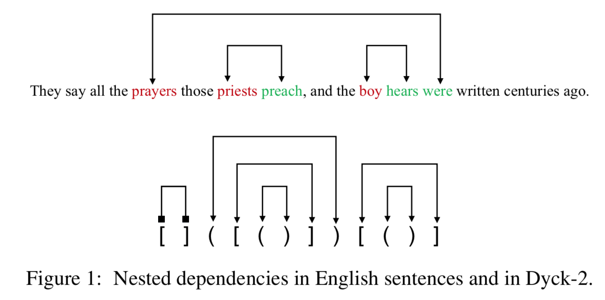
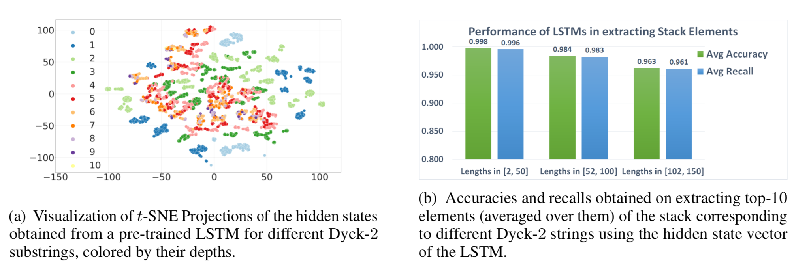

<h2 align="center">
    RNNs-Context-Free-Languages
</h2>
<h4 align="center"> On the Practical Ability of RNNs to Recognize Hierachical Languages </h4>

<p align="center">
  <a href="https://coling2020.org/"></a>
  <a href="https://openreview.net/pdf?id=e-twpMCRFXz"></a>
  <a href="https://github.com/satwik77/RNNs-Context-Free/blob/main/LICENSE">
    
  </a>
</p>


While recurrent models have been effective in NLP tasks, their performance on context-free languages (CFLs) has been found to be quite weak. Given that CFLs are believed to capture important phenomena such as hierarchical structure in natural languages, this discrepancy in performance calls for an explanation. We study the performance of recurrent models on Dyck-n languages, a particularly important and well-studied class of CFLs. 

<h2 align="center">
  
</h2>


We investigate the ability of recurrent models to learn and generalize on Dyck languages. We first evaluate the ability of LSTMs to recognize randomly sampled Dyck-n sequences and find, in contrast to prior works, that they can generalize nearly perfectly when the test samples are within the same lengths as seen during training. Similar to prior works, when evaluated on randomly generated samples of higher lengths we observe limited performance. 

Dyck languages and (deterministic) CFLs can be recognized by (deterministic) pushdown automata (PDA). We construct an RNN that directly simulates a PDA given unbounded precision. A key observation is that the higher the depth of the stack the higher is the required precision. This implies that fixed precision RNNs are expressive enough to recognize strings of arbitrary lengths if the required depth of the stack is bounded. Based on this observation, we test the hypothesis whether LSTMs can generalize to higher lengths if the depth of the inputs in the training and test set is bounded by the same value. In the bounded depth setting, LSTMs are able to generalize to much higher lengths compared to the lengths used during training. Given that natural languages in practical settings also contain nested dependencies of bounded depths, this may help explain why LSTMs perform well in modeling natural language corpora containing nested dependencies.


<h2 align="center">
  
</h2>

We also conducted probing experiments on LSTMs to better understand how they perform these particular tasks. We first attempt to extract the depth of the underlying stack from the cell state of an LSTM model trained to recognize Dyck-2. We found that a single layer feedforward network was easily able to extract the depth with perfect accuracy and generalize to unseen data. Additionally, we also try to extract the stack elements from the hidden states of the network.  We find that not only was the model able to predict the elements in a validation set from the same distribution, it was also able to extract the elements for sequences of higher lengths on which it was not trained on. This further provides evidence to show that LSTMs are able to robustly generalize to inputs of higher lengths when their depths are bounded.


#### Dependencies
- Compatible with Python3.6 and Pytorch 1.2.0
- The necessary packages can be install through requirements.txt.

#### Setup

First create the required directories by running setup.sh
```shell
chmod a+x setup.sh
./setup.sh
```
Install VirtualEnv using the following (optional):

```shell
$ [sudo] pip install virtualenv
```
We recommend creating a virtual environment(optional):

```shell
$ virtualenv -p python3 venv
$ source venv/bin/activate
```
Finally, install the required packages by running:

```shell
pip install -r requirements.txt
```

#### Resources
We provide all the datasets that we mention in the paper which are:
- `Dyck-2`
- `Dyck-2-LengthwiseBins`
- `Dyck-2-DepthwiseBins`
- `Dyck-3`
- `Dyck-3-LengthwiseBins`
- `Dyck-3-DepthwiseBins`
- `Dyck-4`
- `Dyck-4-LenghtwiseBins`
- `Dyck-4 DepthwiseBins`

LengthwiseBins datasets contain strings of bounded depths in the interval [1, 10] for the training as well as the validation sets. Different validation sets have different length interval. DepthwiseBins datasets on the other hand contain strings in both training and validation sets  to be have bounded lengths (in the interval [2, 100]). Each validation set in this case contains strings of a particular disjoint length. Finally, the datasets without either of these specifications are the vanilla datasets described in the paper.

#### Training the model

For training the model with default hyperparameter settings, execute the following command:

```bash
python -m src.main -mode train -run_name testrun -dataset <DatasetName> \
-model_type <ARCHITECTURE> -gpu <GPU-ID>
```
  - `run_name:` A unique identifier for an experiment, the location for storing model checkpoints and logs are determined using this.
  - `dataset:` Which dataset to train and validate the model on, choose from the list of datasets mentioned above.
  - `model_type:` Which type of neural network architecture would you like to choose for running the experiments, choose from RNN (by default LSTM is used), SAN (Transformer encoder).
  - `gpu:` For a multi-gpu machnine, specify the id of the gpu where you wish to run the training process. In case of single gpu just put 0 to use the default gpu. Note that the currently the code won't run without a GPU, we will provide support for running it on a CPU shortly.

Other hypeparameters can be found in the file src/args.py. Some important hyperparameters that might be worth noting are given below:
- `pos_encode:` Only applicable when model_type is SAN, adding -pos_encode in the training command described above, will initialize a transformer that uses absolute positional encodings. Without adding it, the model will not use any form of positional encoding.
- `hidden_size:` Applicable for model_type RNN only and is the hidden size to be used in the network.
- `d_model:` Applicable for model_type SAN and is the size of the intermediate vectors used in the network. Eg. usage -d_model 32
- `heads:` Also applicable for SAN only, specifies the number of attention heads to use.
- `depth:` Number of layers that you would like to initialize your network with.


#### Generating Datasets with different Length and Depth Specifications

We provide our data generation code, which can be used to generate Dyck strings of distributions different from the ones used in the experiments. To generate these custom datasets run something like:

```shell
python generate_data.py -lang Dyck -num_par 2 -dataset Dyck-2-Custom \
-lower_window 2 -upper_window 50 -lower_depth 1 -upper_depth 10 -training_size 10000 -test_size 1000 -bins 2 -bin1_lower_window 52 -bin1_upper_window 100 -bin1_lower_depth 11 -bin1_upper_depth 20 -vary_len -len_incr 50 -vary_depth -depth_incr 10
```
Here,
 - `lang:` refers to the class of language for which you would like to generate data, can be Dyck, Shuffle Parity, Tomita etc.
 - `num_par:` To select a particular language from a family of languages. Specifying 2 here refers to generating Dyck-2 particularly.
 - `dataset:` The directory name where the generated data will be saved. The same name must be used in the training script, if you wish to run training on the generated dataset.
 - `lower_window:` Minimum length of the strings in training dataset.
 - `upper_window:` Maximum length of the strings in training dataset.
 - `lower_depth:` Minimum depth of the strings in training dataset
 - `upper_depth:` Maximum depth of the strings in training dataset. Use -1 if you do not wish to put any restriction on the depth.
 - `training_size:` Number of strings to generate for training data.
 - `test_size:` Number of strings to generate for test/validation data.
 - `bins:` Number of validation bins.
 - `bin1_lower_window:` Minimum length of strings in the first validation bin.
 - `bin1_upper_window:` Maximum length of strings in the first validation bin.
 - `bin1_lower_depth:` Minimum depth of strings in the first validation bin.
 - `bin1_upper_depth:` Maximum depth of strings in the first validation bin.
 - `vary_len:` If you want to vary lengths across different validation bins. 
 - `len_incr:` Only applicable when the -vary_len flag is used. Specifies the amount by which the upper bound of the length will increment across different validation bins.
 - `vary_depth:` If you want to vary depths across different validation bins.
 - `depth_incr:` Only applicable when the `-vary_depth` flag is used. Specifies the amount by which the upper bound of the depth will increment across different validation bins.

In this specific example Dyck-2 strings will be generated with training data containing 10k examples, with the length of the strings lying in the interval [2, 50] and depths in the interval [1, 10]. Apart from that there will be 3 validation bins generated each with 1000 points. Bin-0 will have same length and depth specifications as the training set. Bin-1 will have lengths in the range [52, 100] and depths in [11, 20], and Bin-2 will have lengths and depths in the ranges [100, 150] and [20, 30] respectively.

*Also note that we provide the code to generate a variety of languages like Shuffle, Tomita, Parity etc. which we didn't particularly deal in the paper. Data generation parameters of these languages will be slightly different, so be careful if you wish to generate data for those languages.*